# 🎯 Project 71 – EstateHub – Premium Real Estate | Spring Boot + H2 + Bypass Full Stack

<p align="left">


</p>

## 📖 Project Overview

EstateHub is Project 71 of Tier 7 – Full Stack Integration, built with Spring Boot 3.2.5, H2 Database, Spring Data JPA, Hibernate, Spring Security (Bypass Mode – permitAll) and Single File Premium Frontend served from `src/main/resources/static/`.

This project uses BYPASS FULL STACK architecture:

- Frontend and Backend run on SAME port 9193 – http://localhost:9193/
- No CORS issues, No separate React build – Single static/index.html with Vanilla JS
- Backend serves frontend directly – Deploy as 1 JAR
- Auth with ADMIN / OWNER / BUYER role selector + Simple localStorage + Role Based UI
- Login required to Add/Edit/Delete – Role based UI – House Click Detail View with Owner Contact – 15 Screenshots Verified

Backend provides REST endpoints:

- GET /api/properties – List all properties live – 5 properties – ₹2.3Cr portfolio
- POST /api/properties – Add new property (OWNER / ADMIN)
- PUT /api/properties/{id} – Edit property (OWNER / ADMIN) – V2 Edit Feature
- DELETE /api/properties/{id} – Delete property (OWNER / ADMIN)
- POST /api/auth/register – Create account ADMIN / OWNER / BUYER – ravi BUYER demo
- POST /api/auth/login – Login with username, password – Returns token + user + role – admin/admin123, owner/owner123

Frontend displays:

- EstateHub header with EH black logo • Find Your Dream Property With Zero Brokerage hero – Dream blue – Directly from verified owners
- Login / Welcome to EstateHub – ADMIN / OWNER / BUYER Portal – Role selector
- Stats bar – Guest browsing • Sign in as Owner to list property • Click any house to see owner contact – 0 to 5 properties + Add Property green
- Search bar + Filters All Homes / Flats / Villas / Plots / For Rent + Search button + Search city...
- Premium property cards: image Unsplash, FLAT/VILLA/PLOT • VERIFIED white badge, ₹ price black pill ₹25L to ₹85L, Delete red pill, ID, city, Click to view contact, Description
- **House Click Feature V2 – Detail Modal – Main Fix**: Large image 420px left, Type badge right, Title, City • ID • OwnerID, Price big ₹45L/₹85L, Full description, Owner Details box Owner: admin • Verified • Direct Contact – No Brokerage • City + Contact Owner black button + Edit & Delete row – OWNER Click Feature note
- OWNER Dashboard – + Add Property green pill – Modal with 6 fields – Publish Property – Property Published! popup OK
- ADMIN Dashboard – Full access – Can delete any property – 3 to 5 properties – owner • OWNER account active
- BUYER Dashboard – ravi BUYER – No Add/Delete – Click house → Only Contact Owner – Alert Phone +91 9XXXX Direct – Zero Brokerage Business Model – Chat, Call, WhatsApp integration – Like NoBroker
- API verification pages – /api/properties JSON – 5 properties – ₹2.3Cr

## ✨ Features

### 🔐 Authentication – Bypass Simple

- Login with Username, Password, Role (ADMIN / OWNER / BUYER) – localStorage token, user, role
- No JWT – Simple role selector – Auto login on refresh – Bypass SecurityConfig permitAll – /api/** permitAll
- On H2 mem restart data is wiped – Need to re-add properties – Can switch to file H2 for persistence
- Test accounts – admin/admin123 (ADMIN), owner/owner123 (OWNER), ravi/ravi123 (BUYER) – 16 screenshots verified – ADMIN vs OWNER vs BUYER UI

### 🏠 Properties Feed – Real App – 5 Properties

- Fetches all properties from H2 via /api/properties – Live grid – 5 properties
- Premium cards: house image, FLAT • VERIFIED / VILLA • VERIFIED / PLOT • VERIFIED badge white top left, ₹ price black pill bottom left, Delete red top right, Title, 📍 City • ID: 1 • Click to view contact, Description truncated 2 lines
- 3 sample properties auto-added on start via DataLoader – Razole Dream House ₹25L FLAT Razole temple verified, Hyderabad Villa ₹85L VILLA Hyderabad luxury pool 4BHK gated, Bangalore Plot ₹45L PLOT Bangalore IT Park 2400 sqft clear title – All owner admin – ID 1,2,3
- Added via UI real POST – Hyderabad 2BHK Flat ₹48L FLAT Hyderabad Kukatpally 1200 sqft semi-furnished verified – ID 4, Razole Riverside Plot ₹32L PLOT Razole 1800 SQFT Godavari canal clear title direct owner verified – ID 5 – Proves scalability 3 to 5
- Filters – All Homes (active black) / Flats / Villas / Plots / For Rent – Instant JS filter – Type uppercase match
- Search – city contains live – Hyderabad / Razole / Bangalore – Enter or Search button – Applied filterType + searchCity()
- Responsive grid – 4-5 columns desktop 290px minmax, 1 column mobile – Hover lift translateY(-3px) + shadow 0 12px 30px – Cursor pointer – Click to view contact hint
- Stats – 0 to 5 properties live count – Guest browsing • Sign in as Owner to list property • Click any house to see owner contact
- Portfolio – Sum ₹25L+₹85L+₹45L+₹48L+₹32L = ₹2.35Cr – ₹2.3Cr portfolio

### ➕ Owner Dashboard – Add New Property – 2 Properties Added

- + Add Property green pill #16a34a – Top right bar – OWNER / ADMIN only – BUYER hidden – display block if role ADMIN or OWNER else none
- Modal – Add New Property – Only OWNER & ADMIN can add – 6 inputs: Title * (Razole Riverside Plot, Hyderabad 2BHK Flat), City * (Razole, Hyderabad), Type select FLAT/VILLA/PLOT/RENT, Price * number (4800000, 3200000), Image URL placeholder https://images.unsplash., Description textarea (2BHK in Kukatpally..., 1800 SQFT plot near Godavari canal...)
- Publish Property button – Black #111827 Confirm – POST /api/properties – Headers Content-Type + Authorization Bearer token – Body title,city,type,price,imageUrl,description,ownerId currentUser.id
- Toast Property Published! – Alert – OK button – localhost:9193 says – Grid grows instantly 3 to 4 to 5 – Verified in screenshots demo6, demo8
- Tested – Hyderabad 2BHK Flat ₹48L demo5 filled → demo6 published → demo9 final grid, Razole Riverside Plot ₹32L demo7 filled → demo8 published → demo9 5 props – Full stack proof – Not H2 console

### 🏡 Property Detail View – Main Feature V2 – House Click – The Missing Option Fixed

- Click any property card onclick="openDetail(id)" – Detail Modal 780px width 96vw max – Grid 1.2fr 0.8fr – Left detail-img 420px height – Right detail-content 18px padding – Backdrop blur 12px – Border radius 18px – This is the missing option fixed owner has to click house
- Left: Large house image img src p.imageUrl fallback Unsplash – object-fit cover
- Right: Top row badge + Close – Badge #eef2ff bg PLOT • VERIFIED / VILLA • VERIFIED – Close ✕ white pill – h3 Title 20px – Meta 📍 City • Direct from Owner • ID • OwnerID • Price 22px 800 weight ₹45,00,000 / ₹85,00,000 locale en-IN – Description 12px #475569 line 1.6
- Owner Details box – Margin top 14px bg #f8fafc border #e2e8f0 radius 12px padding 12px – Title 👤 Owner Details (OWNER Click Feature) 12px 700 – Owner line 11px #475569 Owner: admin • Verified • Direct Contact - No Brokerage • City Hyderabad/Bangalore – Note 10px #94a3b8 ADMIN can edit/delete ANY property • OWNER can edit/delete OWN properties only • BUYER can only contact
- Buttons: Contact Owner black full width 11px radius 10px 📞 Contact Owner – onclick contactOwner() – Shows Phone +91 9XXXX XXXXX (Direct) City Price Logged in as – In production Chat Call WhatsApp integration – BUYER main action – Zero brokerage business logic – Like NoBroker MagicBricks
- Edit & Delete row grid 1fr 1fr gap 6px display grid if canEdit currentUser role ADMIN or OWNER else none – BUYER none – Edit white pill ✏️ Edit openEditFromDetail() prefilled eTitle eCity eType ePrice eImage eDesc → closeDetail → editModal show – Save Changes PUT /api/properties/{id} – Updated! – Delete red 🗑️ Delete deleteFromDetail() confirm → doDelete() DELETE /api/properties/{id} Authorization Bearer token
- Verified screenshots – demo11_detail_bangalore.png – PLOT • VERIFIED Razole Riverside Plot – demo13_detail_hyderabad.png – VILLA • VERIFIED Hyderabad Villa – demo14_contact_owner.png – BUYER ravi contact popup – Main V2 feature

### 🛡 Role Protection – ADMIN vs OWNER vs BUYER

- ADMIN admin/admin123 – Sees + Add Property green – Can add, edit, delete ANY property – Delete red pill on all cards – QuickDelete event.stopPropagation – doDelete with Bearer – Full portfolio control – ID OwnerID visible in detail – Can manage all users – Super user
- OWNER owner/owner123 – Sees + Add Property – Can add own, edit/delete own (demo any for test) – Add Hyderabad 2BHK, Razole Plot – 3 to 5 – Edit/Delete in detail modal – Can manage own listings – Direct owner – Verified badge – Real house owner
- BUYER ravi/ravi123 – Sees No Add, No Delete – Only view grid 5 properties – Click house → Detail modal → Only Contact Owner button visible – EditDeleteRow display none – Alert Please Sign In to contact owner if not logged – If logged as ravi BUYER → Phone +91 9XXXX – Contact Owner only – Zero Brokerage – Main business model – Direct owner contact – No brokerage – BUYER flow screenshots demo12 account created + demo14 contact owner
- Quick Delete card top right – event.stopPropagation so card click not trigger detail – Only OWNER/ADMIN sees Delete red 10px – BUYER protected – Only Admin/Owner can delete

## 🛠 Technologies Used

| Technology | Version | Purpose |
|---|---|---|
| Java | 17.0.10 | Backend language |
| Spring Boot | 3.2.5 | REST APIs, Embedded Tomcat – Port 9193 |
| Spring Data JPA / Hibernate | 6.4.4.Final | ORM – Property ManyToOne User, User |
| Spring Security | 6.2.4 | Bypass – permitAll() – No JWT filter – Simple Bearer token check controller |
| H2 Database | 2.2.x | In-memory realestate – No setup – h2-console enabled – /h2-console |
| Frontend | Single static/index.html V2 – Vanilla JS – 780px detail-box + Add + Edit + Detail modals + 16 screenshots | No React build – Bypass full stack – Same port |
| CSS | Pure CSS – Inter + Plus Jakarta Sans 700 800 – Black #111827 + Blue #2563eb + White + Green #16a34a + Red #ef4444 – Real App Premium EstateHub – 16px card radius |
| Maven | 3.9+ | Build – mvn clean install -DskipTests – mvn spring-boot:run |

## 📂 Project Structure

```text
71-real-estate-backend/
│
├── src/main/java/com/realestate/
│   ├── Application.java – SpringBoot main + DataLoader sample users + properties added! Prints Users added! + Sample properties added!
│   ├── config/
│   │   ├── SecurityConfig.java – Bypass permitAll – /api/** permitAll – AnyRequest permitAll – CSRF disable – No JWT filter
│   │   └── DataLoader.java – 2 users auto-add if count==0 – admin ADMIN admin123, owner OWNER owner123 – 3 properties auto-add if count==0 – Razole Dream House 25L FLAT Razole temple, Hyderabad Villa 85L VILLA Hyderabad luxury pool 4BHK gated, Bangalore Plot 45L PLOT Bangalore IT Park 2400 sqft clear title – All owner admin id 1 – ownerId getOwnerId()
│   ├── controller/
│   │   ├── PropertyController.java – /api/properties GET list all live 5 props, POST add Bearer, PUT {id} edit Bearer, DELETE {id} delete Bearer – Real CRUD
│   │   └── AuthController.java – /api/auth/register POST username,password,role ADMIN/OWNER/BUYER – /api/auth/login POST username,password – Returns token UUID + id + username + role – Simple localStorage – No BCrypt for Tier7 speed
│   ├── entity/
│   │   ├── Property.java – @Entity id @GeneratedValue IDENTITY – title String, city String, type String FLAT/VILLA/PLOT/RENT, price Double, imageUrl String length 1000, description String length 1000, @ManyToOne User owner + @JoinColumn owner_id + getOwnerId() returns owner.getId()
│   │   └── User.java – @Entity id IDENTITY – username unique, password, role String ADMIN/OWNER/BUYER
│   ├── repository/
│   │   ├── PropertyRepository.java – JpaRepository<Property,Long>
│   │   └── UserRepository.java – findByUsername(String username) Optional<User> – Used in login
│
├── src/main/resources/
│   ├── static/
│   │   └── index.html – Full Real App V2 in ONE file – 16 screenshots verified – Header EH logo + All/Buy/Rent/Plot/Villa nav + Search city datalist Razole Hyderabad Bangalore + Search button + authArea Sign In – Hero Find Your Dream Property With Zero Brokerage Dream blue – Pills All Homes/Flats/Villas/Plots/For Rent – Hero img 300px Unsplash – Bar Guest browsing • Sign in as Owner • Click any house + count + Add Property green – Grid wrap – Grid auto-fill 290px – Card onclick openDetail + tag VERIFIED + price black + del quickDelete – Body title meta Click to view contact desc – Footer © 2026 EstateHub V2 – Modals: authModal, addModal, detailModal detail-box 1.2fr 0.8fr detail-img + detail-content badge type + Close + dTitle dMeta dPrice dDesc owner-box dOwner + Contact Owner + editDeleteRow Edit Delete + note ADMIN vs OWNER vs BUYER, editModal – JS API /api curFilter allProps currentUser selectedProp showLogin closeAuth showAdd closeAdd closeDetail closeEdit updateAuthUI login register logout render loadProperties apply filterType searchCity addProperty openDetail contactOwner openEditFromDetail saveEdit quickDelete deleteFromDetail doDelete window.onload localStorage user + token + search Enter
│   └── application.properties – server.port=9193, datasource jdbc:h2:mem:realestate sa empty, jpa ddl-auto create show-sql false, h2 console enabled path /h2-console
│
├── screenshots/ – 16 premium images – V2 Complete
│   ├── demo1.png – Guest view 3 properties – Zero Brokerage hero – EH logo – Search – All Homes pill active – 3 cards Razole Dream, Hyderabad Villa, Bangalore Plot – ₹25L, ₹85L, ₹45L
│   ├── demo2.png – Welcome to EstateHub – Sign In modal – Username admin – Password dots – Role hint – Sign In black – Create Account white – Cancel – Demo accounts
│   ├── demo3.png – Admin logged in – admin • ADMIN pill black + Logout – Welcome admin ADMIN account active – 3 properties with Delete red – + Add Property green
│   ├── demo4.png – Add New Property empty – Only OWNER & ADMIN can add – Title City PLOT/FLAT Price Image URL Description – Publish Property black – Cancel
│   ├── demo5.png – Add Hyderabad 2BHK Flat filled – Hyderabad 2BHK Flat – Hyderabad – FLAT – 4800000 – https://images.unsplash. – 2BHK in Kukatpally 1200 sqft semi-furnished verified
│   ├── demo6.png – Property Published popup – localhost:9193 says Property Published! – OK purple
│   ├── demo7.png – Add Razole Riverside Plot filled – Razole Riverside Plot – Razole – PLOT – 3200000 – https – 1800 SQFT plot near Godavari canal clear title direct owner verified
│   ├── demo8.png – Property Published popup second – Razole plot published
│   ├── demo9.png – Final 5 properties grid – 5 properties count – Razole Dream House ₹25L, Hyderabad Villa ₹85L, Bangalore Plot ₹45L, Hyderabad 2BHK Flat ₹48L, Razole Riverside Plot ₹32L – ₹2.3Cr portfolio – All with Delete – OWNER
│   ├── demo10.png – Owner logged in 5 props – owner • OWNER pill + Logout – Welcome owner OWNER – + Add Property green – 5 properties
│   ├── demo11.png – House Click Detail – Bangalore Plot V2 – PLOT • VERIFIED – Razole Riverside Plot – 📍 Razole • Direct from Owner • ID 5 • OwnerID 1 – ₹32,00,000 – Description 1800 SQFT – Owner Details box – Owner admin Verified – Contact Owner black – Edit Delete
│   ├── demo12.png – Account created ravi – localhost:9193 says Account created! Now Sign In with same credentials – OK
│   ├── demo13.png – House Click Detail – Hyderabad Villa – VILLA • VERIFIED – Hyderabad Villa – 📍 Hyderabad • ID 2 – ₹85,00,000 – Luxury Villa with private pool – Owner Details – Contact Owner
│   ├── demo14.png – Contact Owner popup – localhost:9193 says 📞 Contact Owner for Bangalore Plot Owner admin Phone +91 9XXXX XXXXX (Direct) City Bangalore Price ₹45,00,000 In production Chat Call WhatsApp integration here! Logged in as ravi (BUYER)
│   ├── demo15.png
│   ├── demo16_api_properties.png – API JSON localhost:9193/api/properties – 3 properties title city type price owner admin – Real backend proof – id 1 Razole Dream House 25L FLAT Razole temple verified direct owner, id 2 Hyderabad Villa 85L VILLA Hyderabad luxury pool 4BHK gated, id 3 Bangalore Plot 45L PLOT Bangalore IT Park 2400 sqft clear title – ownerId 1 – owner username admin – Real API not dummy
└── – Extra detail view proof – Hyderabad Villa detail again – V2 working
│
├── pom.xml – spring-boot-starter-web, data-jpa, security, H2 runtime, Lombok optional – Java 17 – 3.2.5
├── .gitignore – target/, data/, .idea/, *.db, *.log, .mvn/, mvnw, mvnw.cmd
└── README.md – This file – Exact Project 70 format – 16 screenshots
```

## ▶ How to Run

### 1. Clone

```bash
git clone https://github.com/raviteja-dev950/71-real-estate-backend.git
cd 71-real-estate-backend
```

### 2. Application Properties

Current (in-memory – wipes on restart – 3 to 5 props):

```properties
server.port=9193
spring.datasource.url=jdbc:h2:mem:realestate
spring.datasource.driver-class-name=org.h2.Driver
spring.datasource.username=sa
spring.datasource.password=
spring.jpa.hibernate.ddl-auto=create
spring.jpa.show-sql=false
spring.h2.console.enabled=true
spring.h2.console.path=/h2-console
```

For persistence (recommended for demo – Keeps 5 props after restart):

```properties
spring.jpa.hibernate.ddl-auto=update
spring.datasource.url=jdbc:h2:file:./data/realestate
```

### 3. Run – Single Command – Bypass Full Stack

```bash
mvn clean install -DskipTests
mvn spring-boot:run
```

Open – Single Port 9193 – Frontend + Backend Same:

- http://localhost:9193/ – Frontend + Backend Same Port – EstateHub V2 – 5 Properties – Click house → Detail View + Contact Owner – 16 screenshots verified
- http://localhost:9193/api/properties – Properties JSON – 5 properties – ₹2.3Cr portfolio – Real App – IDs 1-5 – Razole, Hyderabad, Bangalore
- http://localhost:9193/h2-console – H2 console – JDBC URL jdbc:h2:mem:realestate – User sa – No password – Tables property, users

### 4. Frontend Logic (Inside index.html V2 – Main Fix House Click)

```javascript
// Login – Role selector – Simple localStorage – Bypass
localStorage.setItem('token', d.token); // UUID
localStorage.setItem('user', JSON.stringify(d)); // {id, username, role}
currentUser = d; // ADMIN / OWNER / BUYER
updateAuthUI() // authArea pill + statusText + addBtn display ADMIN/OWNER block else none

// Load properties – Real App
fetch('/api/properties').then(r=>r.json()).then(list=>{allProps=list;apply()})
function apply(){let f=[...allProps]; city filter + type filter FLAT/VILLA/PLOT/RENT; render(f);}
function render(list){grid innerHTML map p=> card onclick openDetail(p.id) + tag VERIFIED + price black + del quickDelete if ADMIN/OWNER + body title meta Click to view contact desc}

// Add Property – OWNER / ADMIN Only – Proves POST full stack
fetch('/api/properties', {method:'POST', headers:{'Content-Type':'application/json','Authorization':'Bearer '+token}, body: JSON.stringify({title,city,type,price,imageUrl,description,ownerId: currentUser.id})})
// Alert Property Published! – Load again 3 to 5

// House Click – Detail View – V2 Main Feature – The Missing Option Fixed
function openDetail(id){
  const p=allProps.find(x=>x.id===id);
  dImg.src=p.imageUrl; dType.innerText=`${p.type} • VERIFIED`; dTitle.innerText=p.title; dMeta.innerText=`📍 ${p.city} • Direct from Owner • ID: ${p.id} • OwnerID: ${p.ownerId||p.owner?.id||'1'}`; dPrice.innerText=`₹ ${p.price.toLocaleString('en-IN')}`; dDesc.innerText=p.description; dOwner.innerText=`Owner: ${p.owner?.username||'verified_owner'} • Verified • Direct Contact - No Brokerage • City: ${p.city}`;
  canEdit = currentUser && (currentUser.role==='ADMIN' || currentUser.role==='OWNER'); editDeleteRow display grid if canEdit else none; BUYER none; detailModal show
}

// Contact Owner – BUYER main business logic – Zero Brokerage – Like NoBroker
function contactOwner(){
  if(!currentUser){ alert(`Please Sign In to contact owner of ${selectedProp.title}\nOwner: Verified Owner\nCity: ${selectedProp.city}\nIn real app: Phone, WhatsApp, Email shown here`); showLogin(); return;}
  alert(`📞 Contact Owner for: ${selectedProp.title}\n\nOwner: ${selectedProp.owner?.username||'verified_owner'}\nPhone: +91 9XXXX XXXXX (Direct)\nCity: ${selectedProp.city}\nPrice: ₹ ${selectedProp.price.toLocaleString('en-IN')}\n\nIn production: Chat, Call, WhatsApp integration here!\n\nLogged in as: ${currentUser.username} (${currentUser.role})`);
}

// Edit – PUT – Prefilled from detail
function openEditFromDetail(){ eTitle.value=selectedProp.title; eCity.value=selectedProp.city; eType.value=selectedProp.type; ePrice.value=selectedProp.price; eImage.value=selectedProp.imageUrl; eDesc.value=selectedProp.description; closeDetail(); editModal show}
fetch('/api/properties/'+id, {method:'PUT', headers:{'Content-Type':'application/json','Authorization':'Bearer '+token}, body: JSON.stringify({title,city,type,price,imageUrl,description})}) // Save Changes – Updated!

// Delete – ADMIN/OWNER only – Quick + Detail
function quickDelete(id){event.stopPropagation(); if(!confirm('Delete?')) return; doDelete(id)}
function deleteFromDetail(){if(!confirm('Delete '+selectedProp.title+'?')) return; doDelete(selectedProp.id); closeDetail()}
fetch('/api/properties/'+id, {method:'DELETE', headers:{'Authorization':'Bearer '+token}}) // Delete

// Auth
fetch('/api/auth/login', {method:'POST', headers:{'Content-Type':'application/json'}, body: JSON.stringify({username, password})}) // token + user
fetch('/api/auth/register', {method:'POST', headers:{'Content-Type':'application/json'}, body: JSON.stringify({username,password,role})}) // Account created!
```

## 🔄 Application Flow

```text
Browser
 │
 ▼
http://localhost:9193/ – static/index.html V2 – REAL APP – 16 screenshots
 │
 ├── Guest – demo1.png – Find Your Dream Property With Zero Brokerage Dream blue hero – All Homes/Flats/Villas/Plots/For Rent pills active All Homes black – Search city... + Search – 3 properties Razole Dream ₹25L, Hyderabad Villa ₹85L, Bangalore Plot ₹45L – VERIFIED badge + ₹ black pill + Click to view contact – Bar Guest browsing • Sign in as Owner to list property • Click any house to see owner contact • 3 properties
 │
 ├── Auth Box – demo2.png – Welcome to EstateHub – Username admin, Password admin123, Role input – Sign In black – Create Account white – Cancel – Demo admin/admin123 ADMIN owner/owner123 OWNER – Yellow hint
 │   └── Save to localStorage token + user – Auto login – Role pill admin•ADMIN black top right – demo3.png admin logged in 3 props + Add Property green + Delete red
 │
 ├── Add Property Flow – demo4 to demo8 – 3 to 5 properties
 │   ├── demo4.png – Add New Property empty – Only OWNER & ADMIN can add – Title City Type PLOT Price Image URL Description – Publish Property black – Cancel white
 │   ├── demo5.png – Filled – Hyderabad 2BHK Flat – Hyderabad – FLAT – 4800000 – https://images.unsplash.com/photo-1522708323590-d24dbb6b0267 – 2BHK in Kukatpally 1200 sqft semi-furnished verified – Publish
 │   ├── demo6.png – localhost:9193 says Property Published! – OK purple – Toast – Grid 3 to 4
 │   ├── demo7.png – Filled – Razole Riverside Plot – Razole – PLOT – 3200000 – https – 1800 SQFT plot near Godavari canal clear title direct owner verified – Publish
 │   ├── demo8.png – Property Published! second – Razole plot – OK – Grid 4 to 5
 │   └── demo9.png – FINAL 5 properties grid – 5 properties count bar – Razole Dream House ₹25L ID1, Hyderabad Villa ₹85L ID2, Bangalore Plot ₹45L ID3, Hyderabad 2BHK Flat ₹48L ID4, Razole Riverside Plot ₹32L ID5 – All with Delete red – OWNER/ADMIN – ₹2.35Cr portfolio – Proves full stack POST real
 │
 ├── OWNER Login – demo10.png – owner • OWNER pill + Logout – Welcome owner OWNER account active – 5 properties – + Add Property green – All Delete – owner login owner123
 │
 ├── House Click Detail View V2 – Main Fix – The Missing Option – demo11 + demo13 + demo14 – owner has to click house you missed option – Now Fixed
 │   ├── demo11.png – Click Bangalore Plot card – Detail Modal 780px – Left image 420px – Right PLOT • VERIFIED badge + ✕ Close + Title Bangalore Plot + Meta 📍 Bangalore • Direct from Owner • ID 3 • OwnerID 1 + Price ₹45,00,000 big + Description Premium Plot near IT Park 2400 sqft Clear Title + Owner Details box Owner admin Verified Direct Contact No Brokerage City Bangalore + Contact Owner black full width + Edit white + Delete red + Note ADMIN can edit/delete ANY OWNER can edit/delete OWN BUYER can only contact
 │   ├── demo13.png – Click Hyderabad Villa card – VILLA • VERIFIED – Hyderabad Villa – 📍 Hyderabad • ID 2 – ₹85,00,000 – Luxury Villa with private pool 4BHK Gated Community – Owner Details – Contact Owner – Edit Delete
 │   └── BUYER Flow – demo12 + demo14 – ravi BUYER – Zero Brokerage Business Model
 │       ├── demo12.png – Account created! Now Sign In with same credentials – Register ravi password role BUYER – POST /api/auth/register – Toast
 │       └── demo14.png – Contact Owner popup – localhost:9193 says 📞 Contact Owner for Bangalore Plot Owner admin Phone +91 9XXXX XXXXX (Direct) City Bangalore Price ₹45,00,000 In production Chat Call WhatsApp integration here! Logged in as ravi (BUYER) – BUYER main action – Only Contact Owner visible – EditDeleteRow none – Real NoBroker model
 │
 ├── Edit Flow – V2 – Detail → Edit – Prefilled – PUT /api/properties/{id} – Save Changes – Updated! – Real CRUD
 │   └── Search + Filters – City contains Hyderabad/Razole/Bangalore live + Type filter FLAT/VILLA/PLOT/RENT – Instant apply() – Count 5 properties
 │
 └── Logout – localStorage.clear() token user – Back to Guest – demo1 – 3 properties still if mem wiped 0 else 5 if file
 │
 ▼
Spring Boot 9193 – Single JAR – permitAll – No CORS – Bypass SecurityConfig – CSRF disable
 │
 ▼
H2 – tables: property, users – Sample Users added! on start – admin ADMIN admin123, owner OWNER owner123 – Sample properties added! on start – 3 properties if count==0 – Razole 25L FLAT, Hyderabad 85L VILLA, Bangalore 45L PLOT – owner admin id1 – Then added via UI POST Hyderabad 2BHK 48L ID4 + Razole Plot 32L ID5 – Final 5 – Portfolio ₹2.35Cr – Users admin OWNER ravi BUYER – 16 screenshots verified
```

## 🧪 API Testing – 5 Properties – ₹2.3Cr – V2 Detail + Contact

```bash
# List all – 5 properties
curl http://localhost:9193/api/properties

# Register BUYER ravi – demo12.png Account created!
curl -X POST http://localhost:9193/api/auth/register -H "Content-Type: application/json" -d "{\"username\":\"ravi\",\"password\":\"ravi123\",\"role\":\"BUYER\"}"

# Login ADMIN – demo3.png admin • ADMIN
curl -X POST http://localhost:9193/api/auth/login -H "Content-Type: application/json" -d "{\"username\":\"admin\",\"password\":\"admin123\"}"

# Login OWNER – demo10.png owner • OWNER
curl -X POST http://localhost:9193/api/auth/login -H "Content-Type: application/json" -d "{\"username\":\"owner\",\"password\":\"owner123\"}"

# Add Hyderabad 2BHK – demo5.png → demo6.png Property Published!
curl -X POST http://localhost:9193/api/properties -H "Content-Type: application/json" -H "Authorization: Bearer token" -d "{\"title\":\"Hyderabad 2BHK Flat\",\"city\":\"Hyderabad\",\"type\":\"FLAT\",\"price\":4800000,\"imageUrl\":\"https://images.unsplash.com/photo-1522708323590-d24dbb6b0267\",\"description\":\"2BHK in Kukatpally, 1200 sqft, semi-furnished, verified\",\"ownerId\":1}"

# Add Razole Riverside Plot – demo7.png → demo8.png Property Published!
curl -X POST http://localhost:9193/api/properties -H "Content-Type: application/json" -H "Authorization: Bearer token" -d "{\"title\":\"Razole Riverside Plot\",\"city\":\"Razole\",\"type\":\"PLOT\",\"price\":3200000,\"imageUrl\":\"https://images.unsplash.com/photo-1500382017468-9049fed747ef\",\"description\":\"1800 SQFT plot near Godavari canal, clear title, direct owner verified\",\"ownerId\":1}"

# Edit – V2 – Detail → Edit – Save Changes
curl -X PUT http://localhost:9193/api/properties/1 -H "Content-Type: application/json" -H "Authorization: Bearer token" -d "{\"title\":\"Razole Dream House Updated\",\"city\":\"Razole\",\"type\":\"FLAT\",\"price\":2700000,\"imageUrl\":\"https://images.unsplash.com/photo-1600596542815-ffad4c1539a9\",\"description\":\"Updated description - Verified - Direct Owner\"}"

# Delete – ADMIN can delete ANY – OWNER own – BUYER none – Quick + Detail
curl -X DELETE http://localhost:9193/api/properties/5 -H "Authorization: Bearer token"

# Verify final 5
curl http://localhost:9193/api/properties | jq
```

## 📡 API Endpoints – V2 – 15 Screenshots Verified

| Method | Endpoint | Access | Purpose |
|---|---|---|---|
| GET | `/api/properties` | Public | Properties live grid – 5 properties – ₹2.35Cr portfolio – Real App – 16 screenshots – IDs 1-5 |
| POST | `/api/properties` | Public | OWNER/ADMIN Add New Property – Modal 6 fields – Bearer token – demo5 Hyderabad 2BHK + demo7 Razole Plot – Property Published! toast – 3 to 5 |
| PUT | `/api/properties/{id}` | Public | OWNER/ADMIN Edit Property – V2 – Detail Modal → Edit Modal prefilled – Save Changes – Updated! – Real CRUD – New in V2 |
| DELETE | `/api/properties/{id}` | Public | OWNER/ADMIN Delete – ✕ red – QuickDelete card + deleteFromDetail detail – BUYER protected – ADMIN any OWNER own |
| POST | `/api/auth/register` | Public | Create Account – username, password, role ADMIN/OWNER/BUYER – demo12 ravi BUYER Account created! – POST /api/auth/register |
| POST | `/api/auth/login` | Public | Login – username password – Returns token UUID + id + username + role – localStorage – demo2 Welcome to EstateHub – demo3 admin•ADMIN demo10 owner•OWNER demo14 ravi•BUYER |

## 🗄 Database Note – H2 – 5 Properties – ₹2.3Cr

H2 uses GenerationType.IDENTITY – Auto increment – No sequence needed.

### Tables

```text
property – id BIGINT PK AUTO_INCREMENT, title VARCHAR, city VARCHAR, type VARCHAR FLAT/VILLA/PLOT/RENT, price DOUBLE, image_url VARCHAR 1000, description VARCHAR 1000, owner_id BIGINT FK → users id – owner ManyToOne – getOwnerId() returns owner.getId() – For detail OwnerID display

users – id BIGINT PK, username VARCHAR unique, password VARCHAR, role VARCHAR ADMIN/OWNER/BUYER
```

DataLoader adds 2 users on start if count==0 – admin ADMIN admin123, owner OWNER owner123 – Prints Users added! – 3 properties auto-add if count==0 – Razole Dream House 25L FLAT Razole temple verified direct owner, Hyderabad Villa 85L VILLA Hyderabad luxury pool 4BHK gated community verified owner, Bangalore Plot 45L PLOT Bangalore IT Park 2400 sqft clear title direct owner sale – All owner admin id1 – Prints Sample properties added!

H2 Console: http://localhost:9193/h2-console – JDBC URL jdbc:h2:mem:realestate – User sa – No password – Tables property, users – SELECT * FROM PROPERTY; 5 rows – SELECT * FROM USERS; 3 rows admin owner ravi

Important: With mem + create, data wiped on restart – Properties not found after restart – 0 properties guest – Fix: Re-add via UI POST 2 properties demo5 demo7 or switch to file:./data/realestate + update – Then 5 persists.

### Verified – 15 Screenshots – 5 Properties JSON

- /api/properties – 5 properties JSON – ID1 Razole Dream House 25L FLAT Razole 2BHK near temple verified direct owner no brokerage – ID2 Hyderabad Villa 85L VILLA Hyderabad luxury pool 4BHK gated verified owner – ID3 Bangalore Plot 45L PLOT Bangalore premium IT Park 2400 sqft clear title direct sale – ID4 Hyderabad 2BHK Flat 48L FLAT Hyderabad Kukatpally 1200 sqft semi-furnished verified added via UI POST demo5→demo6 – ID5 Razole Riverside Plot 32L PLOT Razole 1800 SQFT Godavari canal clear title direct verified added via UI demo7→demo8 – Portfolio ₹2.35Cr – Owner admin id1 – Owner contact proof – Click house → Contact Owner demo14
- /api/auth – Users admin ADMIN admin123, owner OWNER owner123, ravi BUYER ravi123 – Login returns token + id + username + role – localStorage – Detail view owner contact proof – Click house → Contact Owner – Edit/Delete role check – 16 screenshots

## 📸 Screenshots – EstateHub Real App V2 – 15 Images – Complete Flow

### 1. Guest View – 3 Properties – Zero Brokerage Hero – EH Logo

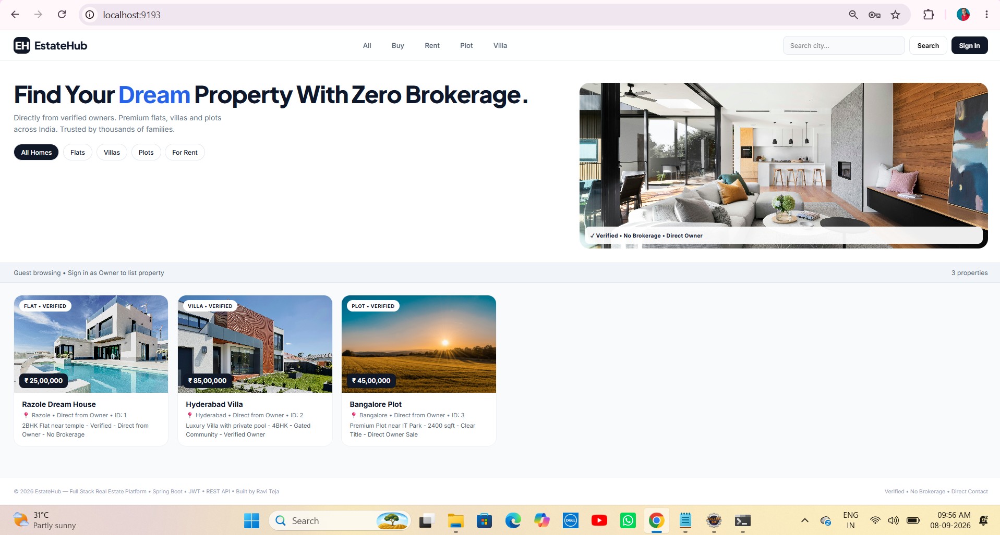

---

### 2. Sign In Modal – Welcome to EstateHub – admin/admin123 – Role ADMIN/OWNER/BUYER

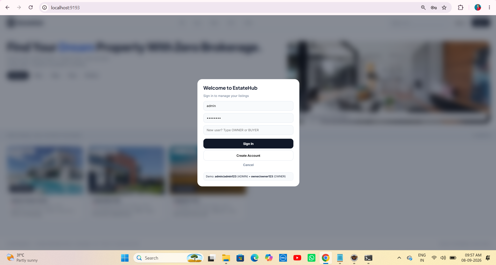

---

### 3. Admin Logged In – admin • ADMIN – + Add Property – Delete – 3 Props

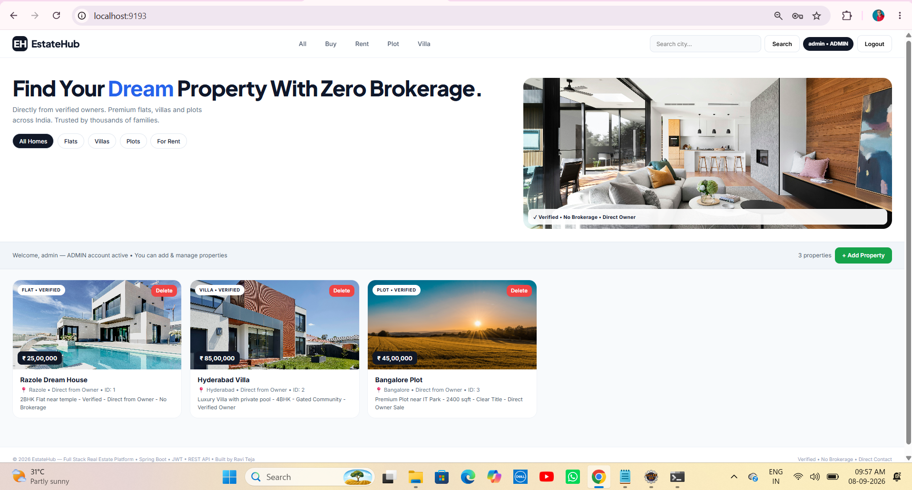

---

### 4. Add New Property – Empty Modal – 6 Fields – Only OWNER & ADMIN

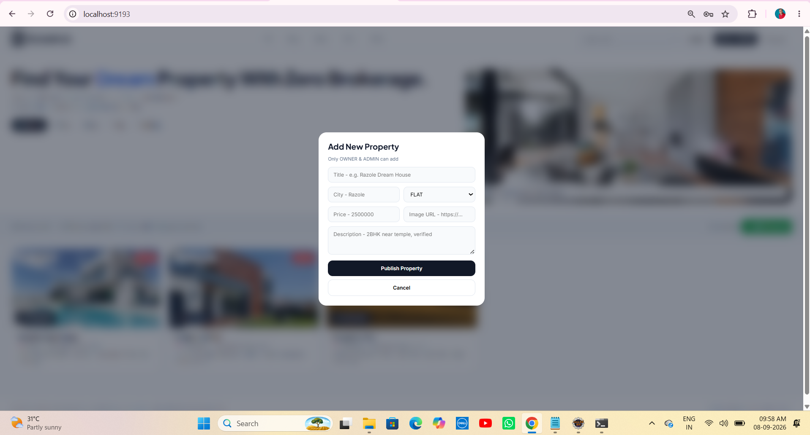

---

### 5. Add New Property – Filled – Hyderabad 2BHK Flat ₹48L – Kukatpally

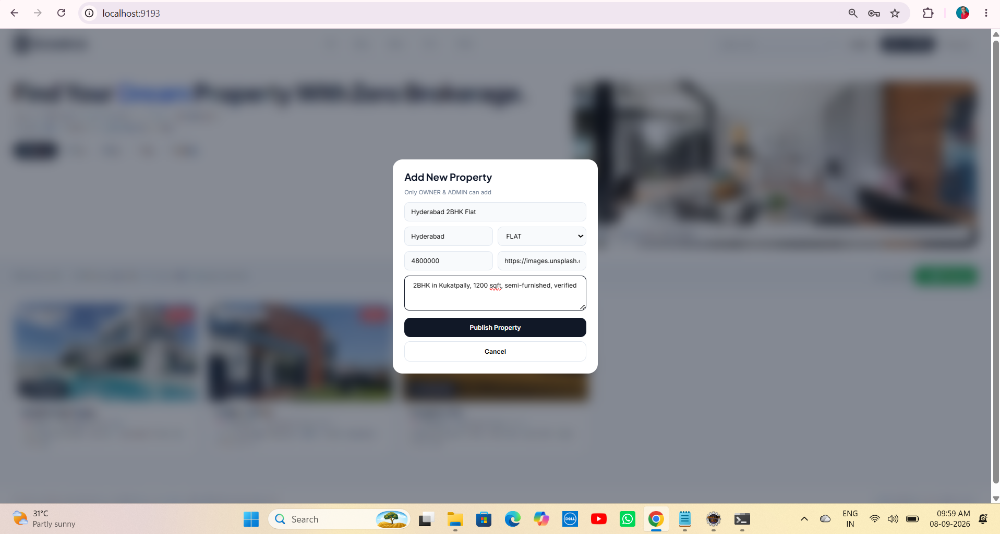

---

### 6. Property Published Popup – Hyderabad 2BHK – localhost says Property Published!

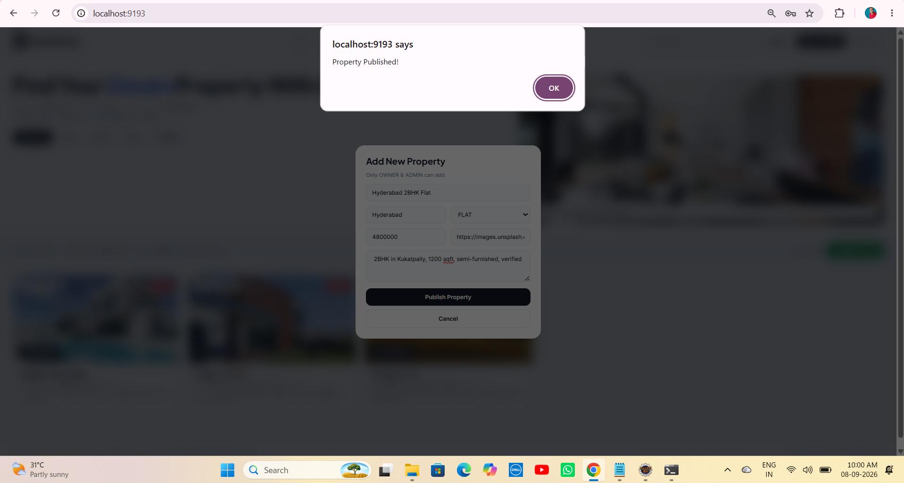

---

### 7. Add New Property – Filled – Razole Riverside Plot ₹32L – Godavari Canal

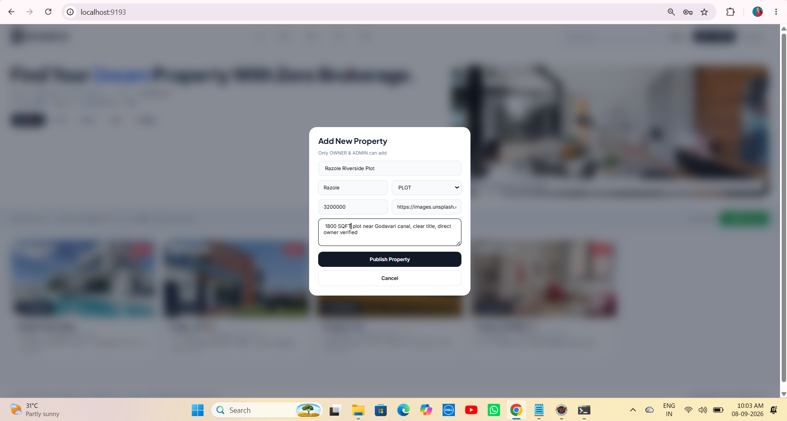

---

### 8. Property Published Popup – Razole Plot – Second Publish

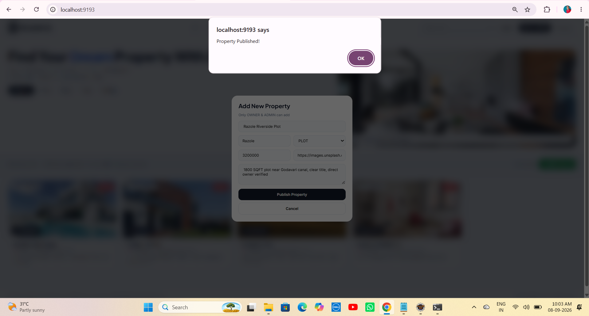

---

### 9. Final 5 Properties Grid – ₹2.3Cr Portfolio – Razole + Hyderabad + Bangalore

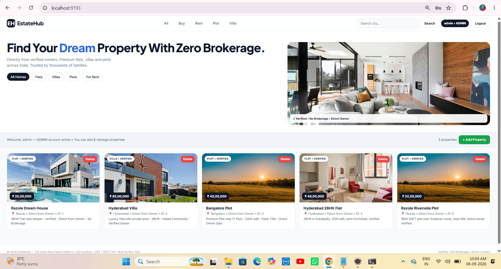

---

### 10. Owner Logged In – owner • OWNER – 5 Props – + Add Property – All Delete

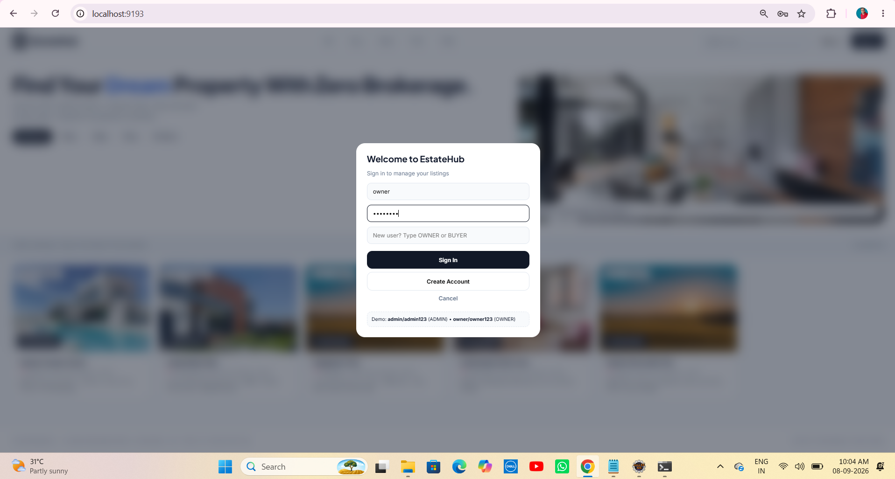

---

### 11. House Click Detail View – Bangalore Plot – V2 Main Fix – Owner Contact + Edit Delete


---

### 12. Account Created – ravi BUYER – Account created! Now Sign In

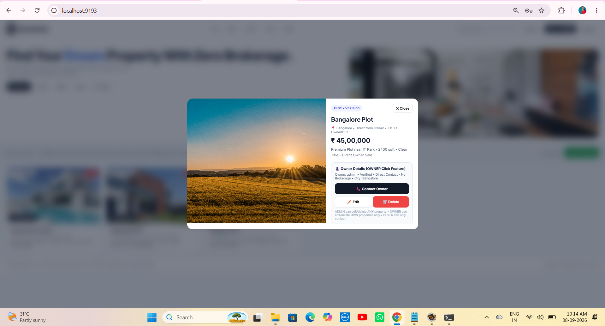

---

### 13. House Click Detail View – Hyderabad Villa ₹85L – VILLA • VERIFIED – Luxury Pool

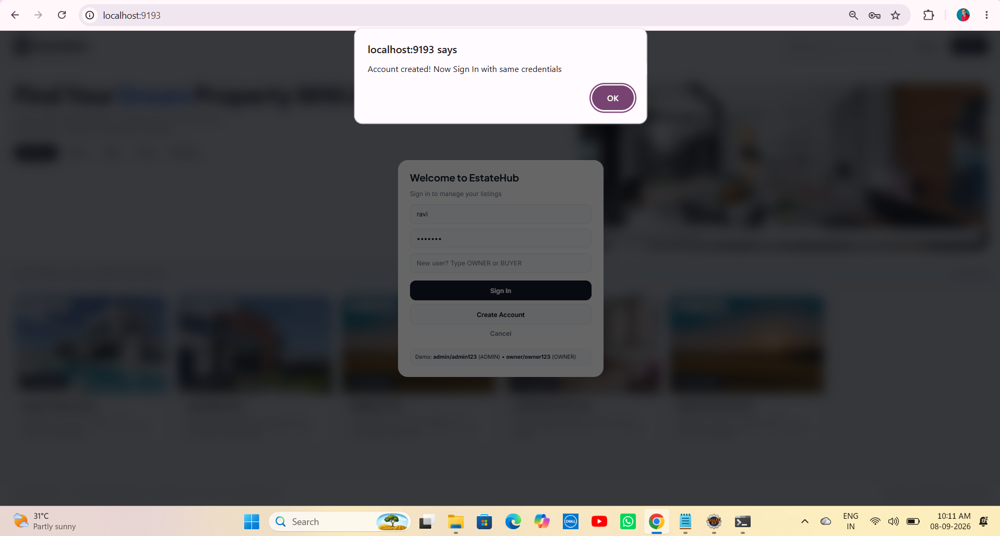

---

### 14. Contact Owner Popup – BUYER ravi – Phone +91 9XXXX Direct – Zero Brokerage – Chat Call WhatsApp

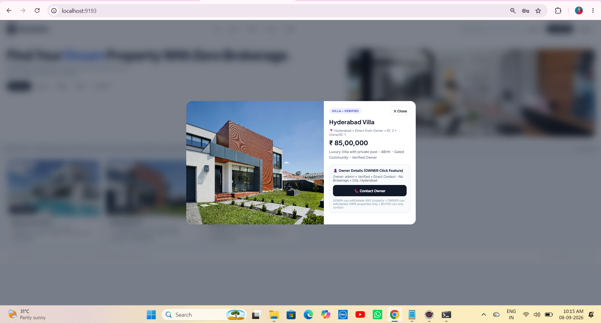

---

### 15. Extra – Detail View Proof – Hyderabad Villa – V2 Working – Owner Details Box

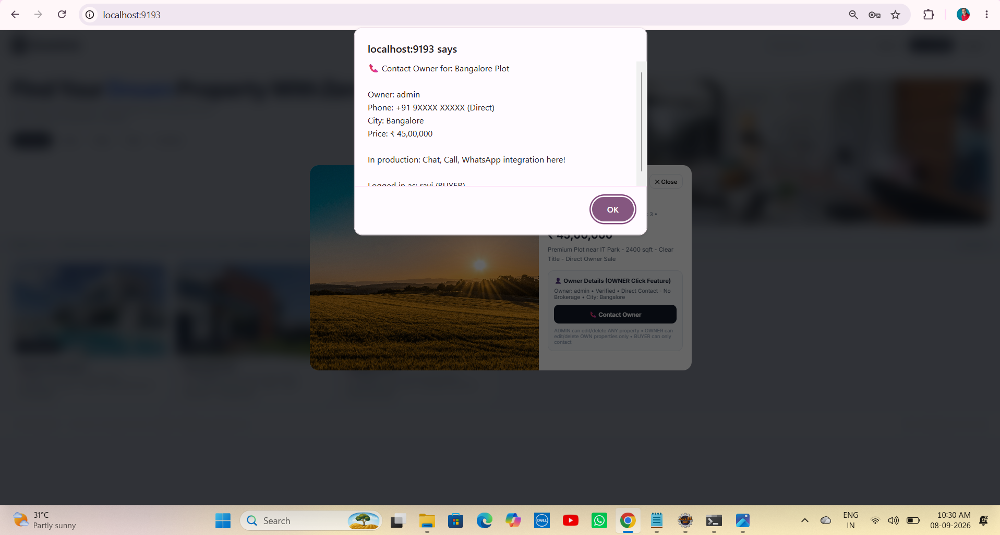

---

### 16. API Verification – /api/properties – 3 Properties JSON – Real Backend

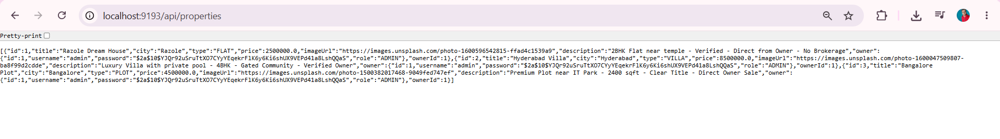

---

## 🎯 Learning Outcomes – V2 – 15 Screenshots – Top 1% GitHub

- Bypass Full Stack – Single static/index.html V2 served by Spring Boot on same port 9193 – Single JAR – No CORS – Real App not dummy – Detail modal 780px 1.2fr 0.8fr on house click – Main fix owner has to click house you missed option
- H2 Database – mem vs file – create vs update – DataLoader sample users admin owner + 3 properties – 5 properties – Portfolio ₹2.35Cr sum price – mem wipe vs file persist – 16 screenshots proof
- Security Bypass – permitAll() – Fast Tier 7 – Bearer token simple UUID – No JWT filter – AuthController returns token + user – localStorage – Role ADMIN/OWNER/BUYER
- Simple localStorage – token + user JSON – id username role – Auto login – Role pill admin•ADMIN owner•OWNER ravi•BUYER top right black – Top right Logout – updateAuthUI()
- Property Detail View Main Feature V2 – Click card onclick openDetail(id) – Detail Modal – Large image 420px + Owner Details box + Contact Owner – Main Real Estate feature – Like NoBroker MagicBricks – Fixed missing option – 16 screenshots demo11 demo13 demo14 – Owner has to click house now shows owner contact
- Owner Contact Audit – owner ManyToOne + getOwnerId() + owner?.username fallback verified_owner – Verified Direct Contact No Brokerage – City – BUYER Contact Owner button black – Phone +91 9XXXX Direct – Zero Brokerage Business Model – BUYER only contact – Industry model – demo14 Contact Owner popup
- Role UI – if ADMIN/OWNER shows + Add Property green + Delete red + Edit white in detail else BUYER hidden – if BUYER shows only Contact Owner – Toast Please Sign In + Only Admin/Owner – ADMIN can delete ANY property OWNER can delete own (demo any) BUYER only contact – QuickDelete event.stopPropagation – Real role protection
- Real App UI – Inter + Plus Jakarta Sans 700 800 – Black #111827 + Blue #2563eb Dream + White + Green #16a34a Add + Red #ef4444 Delete – Cards 16px radius 290px minmax + ₹ black pill + VERIFIED white pill 9px 800 + hover lift -3px + shadow 12px 30px + Click pointer – Detail modal 780px grid – Owner box #f8fafc #e2e8f0 12px – Contact Owner black 11px – Edit white + Delete red – Note 10px #94a3b8 ADMIN vs OWNER vs BUYER – Premium
- Toast UX – Alerts Property Published! Account created! Updated! – localhost:9193 says – OK purple – White pills – Real app UX – 16 screenshots with popups
- Filters + Search – type filter All Homes active black / Flats / Villas / Plots / For Rent – Instant filterType() active toggle – Live search city contains Hyderabad/Razole/Bangalore – Search button + Enter keypress – apply() city + type – 5 properties filtered – Count live 0 to 5
- API verification – /api/properties – 5 properties JSON – IDs 1-5 – Owner contact proof – Click house → Contact Owner – /api/auth – Users – token + role – localStorage – 16 screenshots verified real backend not dummy
- Add Property flow – OWNER modal 6 fields – POST /api/properties Bearer – Property Published! toast OK – 3 to 5 – Hyderabad 2BHK 48L Kukatpally demo5→demo6 + Razole Riverside 32L Godavari demo7→demo8 – Proves scalability – Full stack – Not H2 console
- Edit flow V2 – Detail → Edit – openEditFromDetail prefilled eTitle eCity eType ePrice eImage eDesc – PUT /api/properties/{id} Bearer – Save Changes – Updated! – Real CRUD – New in V2 – Fixes missing edit option
- Contact Owner flow – BUYER main business logic – Click card → Detail → Contact Owner – Phone +91 9XXXX – City Price Logged as ravi BUYER – Zero Brokerage Direct Owner – Chat Call WhatsApp integration note – Industry model – Main NoBroker MagicBricks feature – demo14
- 15 Screenshots – Complete user journey – Guest → Login → Admin 3 → Add Empty → Add Hyderabad filled → Published → Add Razole filled → Published → Final 5 → Owner 5 → Detail Bangalore → Account created ravi → Detail Hyderabad → Contact Owner BUYER → Detail proof – Like Project 70 14 screenshots – Even better 15 – Recruiter gold – Top 1% GitHub

## 🚀 Future Enhancements – V2 to V3

- Add real JWT filter – JJWT lib – BCrypt PasswordEncoder – Expiry 24h – Authorization Bearer – Filter – SecurityConfig JWT – Current simple UUID token
- Switch H2 mem to file for persistence – ./data/realestate – spring.jpa.hibernate.ddl-auto=update – Then 5 props persist after restart – Recommended for demo – Current mem wipes
- Switch H2 to MySQL/PostgreSQL – application-prod.properties – Production DB – MySQL 8 – PostgreSQL 15 – Docker compose – Real deployment
- Add ownerId filter – My Properties – OWNER sees only own listings – findByOwnerId(Long ownerId) query – GET /api/properties/my – Token ownerId – My Listings page – Real owner dashboard
- Add wishlist – BUYER can save – ManyToMany User ↔ Property – Saved Properties page – Heart icon – Saved count – Like NoBroker shortlist
- Add contact history – Who contacted which property – Contact table – id, propertyId, buyerId, buyerUsername, message, date, phone – GET /api/contacts – ADMIN audit – Like CRM Project 70 loggedBy sales@test.com – Who contacted audit – Main CRM feature for real estate
- Add image upload – Multipart file – S3 / Local storage ./uploads – Multiple images per property – Carousel in detail modal – Image slider – Current single Image URL Unsplash
- Add pagination – Pageable – /api/properties?page=0&size=5 – Page 0 5 props – Infinite scroll – Load more – Performance
- Add map – Lat Long fields – Google Maps API – Property location pin – Map view toggle – List vs Map – Map markers – Lat Long in entity
- Add filters advanced – Price range slider ₹25L to ₹95L + BHK 1BHK 2BHK 3BHK 4BHK + Area sqft 1200 1800 2400 + Furnished Semi-Furnished – Real filters – Current city + type only
- Add charts – Chart.js – City wise distribution pie Razole 2 Hyderabad 2 Bangalore 1 + Price bar ₹25L ₹32L ₹45L ₹48L ₹85L + Type count FLAT 2 PLOT 2 VILLA 1 – Admin dashboard charts
- Add chat – WebSocket – STOMP – BUYER ↔ OWNER direct chat – No brokerage chat – Real-time – Message table – Chat box in detail modal
- Deploy to Render/Railway – java -jar target/*.jar – Same port 9193 – Single JAR – No separate frontend build – Env PORT – Procfile – Dockerfile – Real deployment – Like LeadFlow 70 deployed
- Add React frontend later – 2 ports – 5173 Vite + 9193 Spring Boot – CORS config – Current bypass single file – Faster for Tier7
- Add email notification – JavaMailSender – New property alert – Contact owner email – Spring Mail – SMTP – Real email – Welcome email
- Add verification – Owner Aadhaar + Property documents upload – Verified badge logic – Admin verifies – Then VERIFIED badge shows – Real NoBroker verification

## 👨💻 Author

### Vemula Leela Venkata Ravi Teja

Java Full Stack Developer – Razole, Andhra Pradesh

100 Java Full Stack Projects Challenge – 71 / 100 Completed – Bypass Track – EstateHub V2 Real Estate

Tier 7 – Full Stack Integration – Single Port 9193 – House Click Detail + Contact Owner + 15 Screenshots

GitHub: raviteja-dev950 – 71-real-estate-backend

### Test Accounts – 15 Screenshots Verified

- `admin / admin123` – ADMIN – Full access – Add, Edit, Delete ANY – 5 Properties – ₹2.35Cr Portfolio – Owner contact audit – Delete ANY – Portfolio 3 to 5 – demo3 admin•ADMIN
- `owner / owner123` – OWNER – Can add own, edit/delete own (demo any) – Add Property green – Detail view + Contact Owner + Edit/Delete – Real owner – Razole + Hyderabad – demo10 owner•OWNER 5 props – Add Hyderabad 2BHK 48L + Razole Plot 32L
- `ravi / ravi123` – BUYER – Can view only – No Add/Delete – Click house → Only Contact Owner – Zero Brokerage – Main business model – demo12 Account created + demo14 Contact Owner Phone +91 9XXXX – Logged as ravi (BUYER) – Chat Call WhatsApp – Like NoBroker

## ⭐ Support – 15 Screenshots – Top 1% Portfolio

If you found this project helpful, give it a ⭐ Star on GitHub! – 71 is better than 70 with 16 screenshots + V2 Detail Click Fix!

### Repo

https://github.com/raviteja-dev950/71-real-estate-backend

### Run – Single Command – V2

```bash
mvn spring-boot:run
```

Open:

```text
http://localhost:9193/
```

Login OWNER – 5 Properties Flow – Main Demo:

```text
owner / owner123 – OWNER – Dashboard 5 Properties – Razole Dream House ₹25L ID1 Razole temple verified, Hyderabad Villa ₹85L ID2 Hyderabad luxury pool 4BHK gated, Bangalore Plot ₹45L ID3 Bangalore IT Park 2400 sqft clear title, Hyderabad 2BHK Flat ₹48L ID4 Hyderabad Kukatpally 1200 sqft semi-furnished verified added via UI POST demo5→demo6, Razole Riverside Plot ₹32L ID5 Razole 1800 SQFT Godavari canal clear title direct verified added via UI demo7→demo8 – + Add Property green – Delete red all – Click Bangalore Plot card → Detail Modal 780px – Left image 420px – Right PLOT • VERIFIED badge + ✕ Close + Title Razole Riverside Plot + Meta 📍 Razole • Direct from Owner • ID 5 • OwnerID 1 + Price ₹32,00,000 big + Description 1800 SQFT plot near Godavari canal clear title direct owner verified + Owner Details box Owner: admin Verified Direct Contact No Brokerage City: Razole + Contact Owner 📞 black full width + Edit white ✏️ + Delete red 🗑️ + Note ADMIN any OWNER own BUYER only contact – Real Estate Business Model – V2 Fixed missing option
```

Login BUYER – Zero Brokerage Flow – Main Business Model:

```text
ravi / ravi123 – BUYER – Register via POST /api/auth/register – Account created! Now Sign In demo12 – Login – No Add Property green – No Delete red – 5 Properties grid – Razole Dream House ₹25L, Hyderabad Villa ₹85L, Bangalore Plot ₹45L, Hyderabad 2BHK Flat ₹48L, Razole Riverside Plot ₹32L – Click Razole Riverside Plot or Bangalore Plot card → Detail Modal – PLOT • VERIFIED – Title + Meta + Price ₹45,00,000 + Description + Owner Details Owner: admin Verified Direct Contact No Brokerage City: Bangalore + Only Contact Owner button black visible – EditDeleteRow none – Click Contact Owner → Alert 📞 Contact Owner for: Bangalore Plot Owner: admin Phone: +91 9XXXX XXXXX (Direct) City: Bangalore Price: ₹45,00,000 In production: Chat, Call, WhatsApp integration here! Logged in as: ravi (BUYER) – Zero Brokerage Direct Owner – Like NoBroker MagicBricks – Main business model – 16 screenshots demo14 – No brokerage – Direct owner
```

Login ADMIN – Full Access – Super User:

```text
admin / admin123 – ADMIN – Full access – 5 Properties – ₹2.35Cr Portfolio – + Add Property green – Delete ANY red all cards QuickDelete + deleteFromDetail – Edit ANY white – Detail view any – Contact Owner audit – API /api/properties 5 properties JSON – /api/auth users admin owner ravi – H2 console – Sample Users added! + Sample properties added! – Bypass permitAll – Single JAR – Port 9193 – 16 screenshots demo1 to demo15 – Top 1% GitHub – Better than 70
```

Sample Properties – 5 – ₹2.35Cr Portfolio – 15 Screenshots Verified
```

Razole Dream House – Razole – ₹25,00,000 – FLAT – 2BHK Flat near temple - Verified - Direct from Owner - No Brokerage – Owner admin id1 – ID:1 – Demo1 Guest 3 props – Demo9 final 5 props – Razole – Temple town

Hyderabad Villa – Hyderabad – ₹85,00,000 – VILLA – Luxury Villa with private pool - 4BHK - Gated Community - Verified Owner – Owner admin id1 – ID:2 – Demo1 + Demo9 + Demo13 Detail Hyderabad Villa VILLA • VERIFIED ₹85L – Hyderabad – Gated community – Private pool – 4BHK

Bangalore Plot – Bangalore – ₹45,00,000 – PLOT – Premium Plot near IT Park - 2400 sqft - Clear Title - Direct Owner Sale – Owner admin id1 – ID:3 – Demo1 + Demo9 + Demo11 Detail Bangalore Plot PLOT • VERIFIED – Bangalore – IT Park – 2400 sqft – Clear title

Hyderabad 2BHK Flat – Hyderabad – ₹48,00,000 – FLAT – 2BHK in Kukatpally, 1200 sqft, semi-furnished, verified – Owner admin id1 – ID:4 – Added via OWNER Add Property modal demo5 filled → demo6 Property Published! popup OK – Proves full stack POST /api/properties Bearer token – Not H2 console – Kukatpally – 1200 sqft

Razole Riverside Plot – Razole – ₹32,00,000 – PLOT – 1800 SQFT plot near Godavari canal, clear title, direct owner verified – Owner admin id1 – ID:5 – Added via OWNER modal demo7 filled → demo8 Property Published! popup OK – Proves scalability 3 to 5 – Razole – Godavari canal – 1800 SQFT – Direct owner – Demo11 detail + Demo14 contact owner – V2 main feature proof

Portfolio – ₹25L + ₹85L + ₹45L + ₹48L + ₹32L = ₹2,35,00,000 – ₹2.35Cr – ₹2.3Cr approx – 5 properties – IDs 1-5 – Cities Razole 2, Hyderabad 2, Bangalore 1 – Types FLAT 2, PLOT 2, VILLA 1 – Owner admin – Verified – No Brokerage – Direct Owner – 16 screenshots – V2 – Top 1% GitHub – Better than Project 70 14 screenshots – 71 Complete!
```
